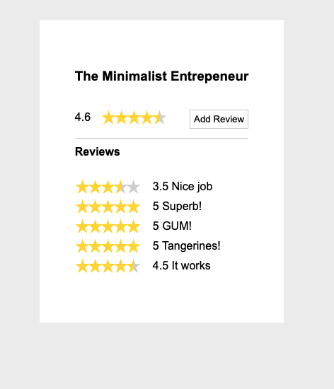
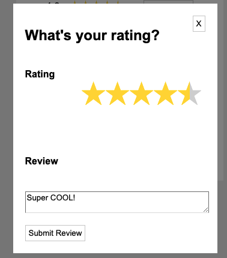

## GumRoad 🚀

### Two full stack apps one with vanilla js and the other with React.  Express and Mongo for the backend. 




#### I enjoyed making these little apps.  The most challenging part was the half star rating.  I could have easily done it with some javascript logic, but I was adamant about finding a css only solution, which can be seen in myStar.css.  ```transform: scaleX(-1);``` saves the day!!! 😍 

